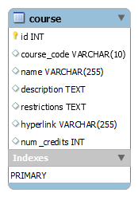
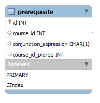
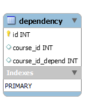
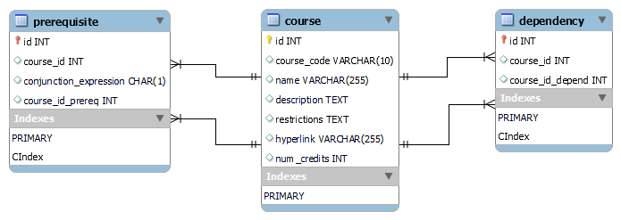

## Database Purpose

Store University of Saskatchewan courses, defining prerequisite and dependency relationships to corresponding sets of courses.

## Datapoints

### Relevant Links:

- University of Saskatchewan Course Catalogue (all courses): [https://catalogue.usask.ca/](https://catalogue.usask.ca/)

### Course

- Course code
  - e.g., CMPT 370
  - The structure consists of a of a two-four letter String, a space, and an integer code
    - Because of the initial String, this datapoint can be represented as a String
  - The decimal point and following numbers may be ignored (e.g., the ".3" in CMPT 370.3 can be ignored)
- Name
  - e.g., Intermediate Software Engineering
  - Can be represented as a String
- Description
  - e.g., Principles and techniques for developing software combined with the practical experience of creating a mid-size software system as a member of a software development team. Includes: teamwork; projects, planning and process; users and requirements; use cases; modeling; quality; software architecture; testing; GUI design, design principles, patterns and implementation; ethics; professionalism.
  - Can be represented as a String
- Prerequisite(s)
  - e.g., CMPT 280
  - Must be consistent with the Course Code datapoint
- Restriction(s)
  - e.g., Restricted to students in Applied Computing.
  - Can be represented as a String
- Hyperlink
  - e.g., [https://catalogue.usask.ca/CMPT-370](https://catalogue.usask.ca/CMPT-370)
  - Can be represented as a String
- Number of credits
  - e.g., 3
  - This can be derived from the original course code (e.g., the ".3" in CMPT 370.3 represents three credits)

## Theory

### Prerequisite Definition

Let C be the set of all courses. Define P ⊆ C as the set of all prerequisites. Given a course c ∈ C, define p ∈ P recursively as a set representing the prerequisites of c st it holds one of the following forms ∀p1, ..., pn ∈ P, ∀ci ∈ C:

- p = Ø
- p = {ci}
- p = {p1, ..., pn}
- p = p1 v ... v pn

Note, form four follows the conventional definition of v (that is, an inclusive disjunction).

### Dependency Definition

Let C be the set of all courses. Let P be the set of all prerequisites. Define D ⊆ C as the set of all dependencies. Given a course c ∈ C, define d ∈ D st if it is a dependency of c, then c ∈ P and c is a prerequisite of d.

## MySQL Tables

For each table, the first row is the fields and the latter are example records. Datatypes and incrementation are included for specificity.

### Course Table

Perhaps unintuitively, there is no column for a foreign key to a prerequisite record. While I tried this method--storing an entry for a prerequisite in the prerequite table corresponding to each course--initially, it could not handle the relational complexity of the prerequisite definition above. Thus, I have configured a more abtrast solution; you can see it defined in writing and in the tables for the prerequisite table below.

Primary key: id

| id : INT , AUTO_INCREMENT | course_code : VARCHAR(10) | name : VARCHAR(255)                 | description : TEXT                                                                                                                                                                                                                                                                                                                                                                                           | restrictions : TEXT                            | hyperlink : VARCHAR(255)            | num_credits : INT |
| ------------------------- | ------------------------- | ----------------------------------- | ------------------------------------------------------------------------------------------------------------------------------------------------------------------------------------------------------------------------------------------------------------------------------------------------------------------------------------------------------------------------------------------------------------ | ---------------------------------------------- | ----------------------------------- | ----------------- |
| 5                         | "CMPT 370"                | "Intermediate Software Engineering" | "Principles and techniques for developing software combined with the practical experience of creating a mid-size software system as a member of a software development team. Includes: teamwork; projects, planning and process; users and requirements; use cases; modeling; quality; software architecture; testing; GUI design, design principles, patterns and implementation; ethics; professionalism." | "Restricted to students in Applied Computing." | https://catalogue.usask.ca/CMPT-370 | 3                 |

### Prerequisite Table

The course_id column references a course. The same course often appears in multiple rows to define logical expressions.

Because of the multi-form nature of prerequisites as seen in the definition, one of two general forms could be maintained: conjunctive normal form or disjunctive normal form. While not followed strictly or mathematically, the latter was selected; prerequisites of a course are seperated on the foundational level using disjunctions. This is done using the disjunction_expression field. In particular, for a given course, the disjunction_expression represents a variable or a logical expression that is part of the larger disjunction. Thus, different disjunction_expression's represent different variables or logical expressions in the disjunction. Multiple rows with the same disjunction_expression indicate conjunction. Accordingly, the logical expressions representing the prerequisites for a given course are a set of disjunctive conjunctions. This holds by the definition of disjunctive normal form, as potential inner disjunctions can be equivalently factored outward using axiomatic associativity.

The course_id_prereq field stands for a corresponding prerequisite course from the course table.

Primary key: id

Foreign keys

- course_id
- course_id_prereq

Examples:

- Numbers represents a course
- Example one: 23 AND 41
- Example two: 93 OR 20
- Example three: (103 AND 31) OR (11 AND 66)

| id : INT , AUTO_INCREMENT | course_id : INT | disjunction_expression : CHAR(1) | course_id_prereq : INT |
| ------------------------- | --------------- | -------------------------------- | ---------------------- |
| 1                         | 3               | a                                | 23                     |
| 2                         | 3               | a                                | 41                     |
| 3                         | 17              | a                                | 93                     |
| 4                         | 17              | b                                | 20                     |
| 5                         | 5               | a                                | 103                    |
| 6                         | 5               | a                                | 31                     |
| 7                         | 5               | b                                | 11                     |
| 8                         | 5               | b                                | 66                     |

### Dependency Table

The course_id and course_id_depend are analogous to those in the Prerequisite Table. The relationship is such that for a given course all its dependency courses are listed in different columns. This does necessitate a course being duplicated in multiple records. However, the (positive) trade-off is that this table is easy to auto-populate and draw relationships to/from other tables.

Primary key: id

Foreign keys

- course_id
- course_id_depend

Examples:

- Numbers represents a course
- Courses 32, 11, and 4 are dependencies of course 65

| id : INT , AUTO_INCREMENT | course_id : INT | course_id_depend : INT |
| ------------------------- | --------------- | ---------------------- |
| 1                         | 65              | 32                     |
| 2                         | 65              | 11                     |
| 3                         | 65              | 4                      |

## Enhanced-Entity Relationship Diagram (EER)

